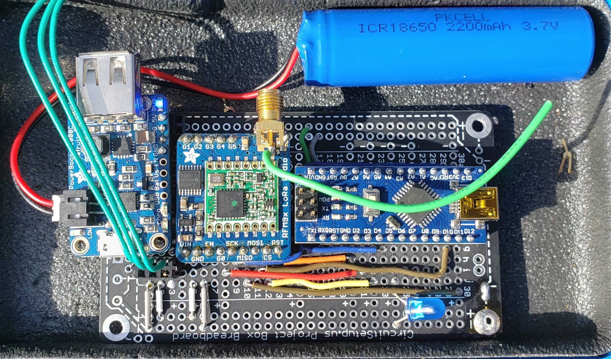
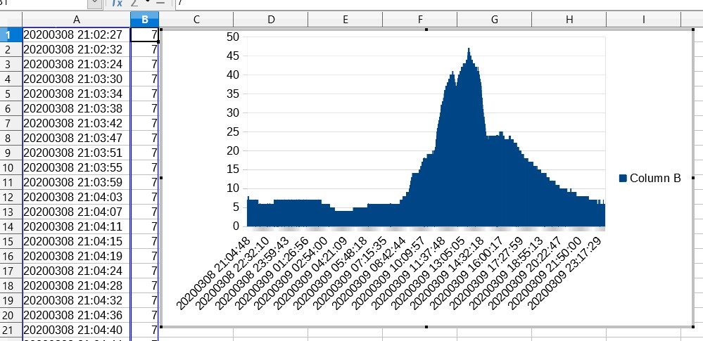
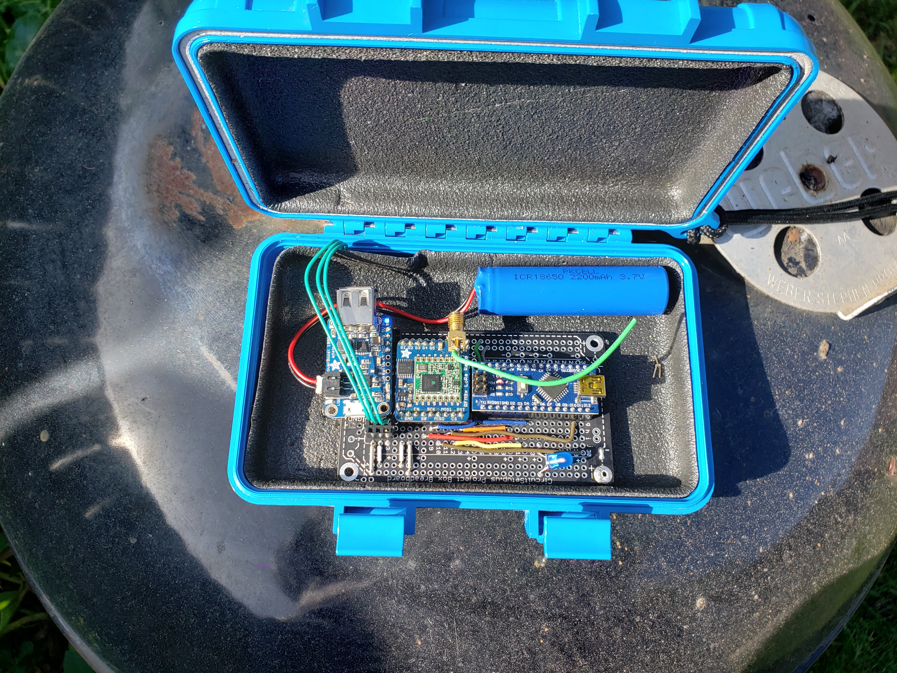

# Portable wather station
## by oran c (wisemonkey)
### 20200307

parts list
- Arduino nano (or uno) x1
- [humidity sensor x1](https://www.amazon.com/Temperature-Humidity-Digital-3-3V-5V-Raspberry/dp/B07WT2HJ4F/ref=sr_1_2?keywords=dh11+humidity+sensor&qid=1583824327&sr=8-2)
- led x2
- [adafruit RFM9X Lora 915hrz radio](https://www.adafruit.com/product/3072) 
- [adafruit PowerBoost 1000 Charger | its a Rechargeable 5V Lipo USB Boost @ 1A - 1000](https://www.adafruit.com/product/2465)
- [Lithium Ion Cylindrical Battery - 3.7v 2200mAh](https://www.adafruit.com/product/1781)
-  AND! 
- most importanly
- 
- free time  

----

- read from humidity sensor > save to sd card

Setting up adafruit feather [not no longer used in project!]
(add to arduino's package manager)
https://adafruit.github.io/arduino-board-index/package_adafruit_index.json

how to use sd card with adafruit adalogger
https://learn.adafruit.com/adafruit-feather-m0-adalogger/using-the-sd-card?embeds=allow

adalogger pinout diagram

## Hardware
Here's the final build.
pictured is a adafruit

## Results
Pictured bellow is temperature readings from the weather station outside my house over 1 day and night. notice how the high point around 45c (mesured in celcius) corrisponds to the day and the nigh time is low with 5c. the data is skused because the weather station was on top of a barbicue and thouse got hotter then the abent temperature outside (oh well face emoji). 

-----
## More photos
-----

- 
- close up of the led and the arduino nano
- 
