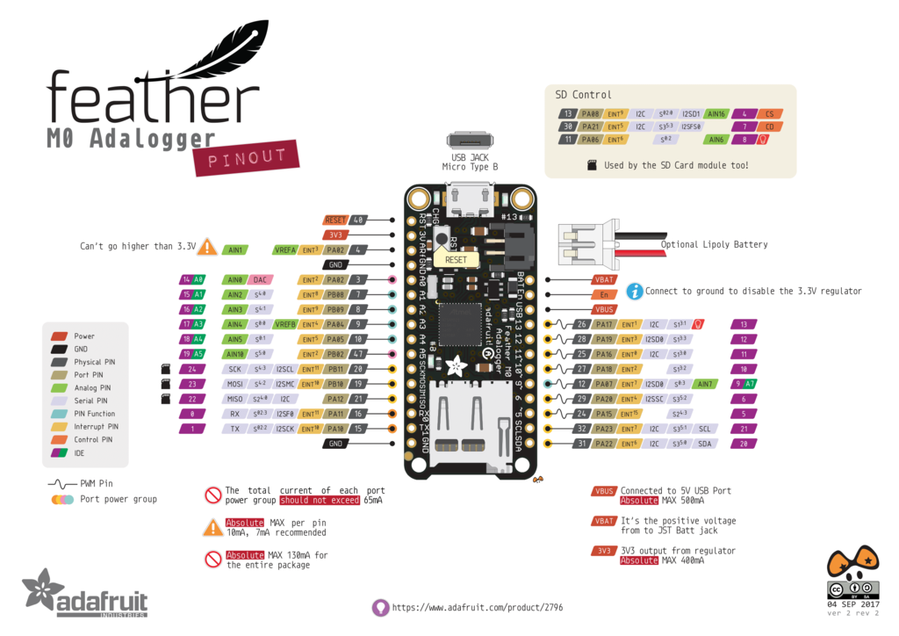

# Portable wather station
## by oran c (wisemonkey)
### 20200307

parts list
- adafruit feather adalogger x1
- humidity sensor x1
- led x1
- determination > 9000
- time > more

Setting up adafruit feather 
add to arduino's package manager
https://adafruit.github.io/arduino-board-index/package_adafruit_index.json

adalogger pinout diagram
