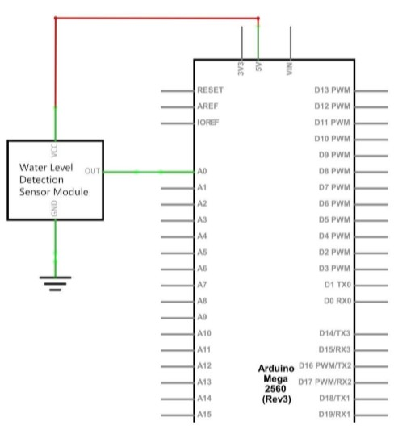

# Portable wather station

### Written&coded by oran collins
### oranbusiness@gmail.com
### github.com/wisehackermonkey


parts list
- Arduino nano (or uno) x1
- [humidity sensor x1](https://www.amazon.com/Temperature-Humidity-Digital-3-3V-5V-Raspberry/dp/B07WT2HJ4F/ref=sr_1_2?keywords=dh11+humidity+sensor&qid=1583824327&sr=8-2)
- led x2
- [adafruit RFM9X Lora 915hrz radio](https://www.adafruit.com/product/3072) 
- [adafruit PowerBoost 1000 Charger | its a Rechargeable 5V Lipo USB Boost @ 1A - 1000](https://www.adafruit.com/product/2465)
- [Lithium Ion Cylindrical Battery - 3.7v 2200mAh](https://www.adafruit.com/product/1781)
-  AND! 
- most importanly
- 
- free time  

----
## Getting started 
download the repo. 
flash the Arduino sketch on both the receiver and arduinos. 
`trails off....` this  project is for fun and im recording this here just for show and tell, if you take the challenge of running my code, please just email me if you get any questions.

<!-- - read from humidity sensor > save to sd card -->
<!-- 
Setting up adafruit feather [not no longer used in project!]
(add to arduino's package manager)
https://adafruit.github.io/arduino-board-index/package_adafruit_index.json -->

<!-- 
how to use sd card with adafruit adalogger
https://learn.adafruit.com/adafruit-feather-m0-adalogger/using-the-sd-card?embeds=allow -->

Arduino nano pinout diagram

## Wiring
----------------------------
### arduino pinout for the DHT11,

```
VCC: 5V or 3V
GND: GND
DATA: pin 5
```
 

### water sensor pinout
```
sensor | arduino uno/nano

 S  - A2 (you can use any analog pins A0-5)
(+) - v5
(-) - GND
```
 

### Pinout
```
13 - SCK (RFM9x)
12 - MISO (RFM9x)
11 - MOSI (RFM9x)
06 - LED (+) indecator (used for flashing codes)
05 - USED by humidiy sensor
04 - CS (RFM9x)
03 - G0 (RFM95_INT is a interrupt pin) (RFM9x)
02 - RST (RFM9x)
A2 - water sensor (read)
```
----------------------------
## Installing/running pyserial python server
#### works on raspberry pi and windows, it might work with mac not fully tested, please email me if  you get it working! :)

```
cd path/path/to/github/repo
>pip install -r requirements.txt

(linux)
>pip3 install -r requirements.txt
```
or 
```
>pip install pyserial
```

#### Run the server
Note: plug in the second receiving arduino before running the server
```
>git clone https://github.com/wisehackermonkey/20200307_weather_station_portable.git
>cd path/path/to/github/repo
or
>cd ./20200307_weather_station_portable
>python .\python_scripts\serial_to_csv.py 
```

#### run in background
```
(python3 windows)
nohup python .\python_scripts\serial_to_csv.py  &
or (linux)
nohup python3 ./python_scripts/serial_to_csv.py  &

```

----------------------------

## Hardware
Here's the final build.
pictured is a adafruit


## Results
Pictured bellow is temperature readings from the weather station outside my house over 1 day and night. notice how the high point around 45c (mesured in celcius) corrisponds to the day and the nigh time is low with 5c. the data is skused because the weather station was on top of a barbicue and thouse got hotter then the abent temperature outside (oh well face emoji). 

With a 2200mAh battery my project lasted 1.1857 days on one charge! I was expecting at most 6 hours tops, im really impressed with the low mA's that everything is using.


-----
## More photos
-----

- 
- close up of the led and the arduino nano
- 
----------------------------
## Update 20200315
### added water detection sensor
#### (water sensor is the red flat board sticking out, below the blue led)


--------------
## Photos from the water sensor Elegoo Tutorial
#### water sensor im using


----------------------------

#### wiring diagram for water sensor without rest of project

#### fritzing view


#### example useage


----------------------------
Written by oran collins
oranbusiness@gmail.com
github.com/wisehackermonkey